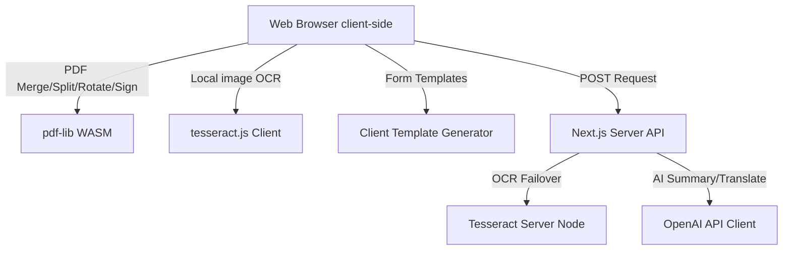

# PDF Studio - Architecture & Feature Reference Guide

This document outlines the detailed system architecture, codebase layout, feature workflows, data privacy model, and SEO implementation for **PDF Studio**.

---

## 1. System Architecture Overview

PDF Studio is designed as a task-first, zero-retention document processing utility. The system balances high-performance client-side operations (to minimize hosting cost and preserve data privacy) with resilient server-side routes for API integrations and fallback processing.



### Key Technical Dependencies
1. **`pdf-lib`**: Loaded dynamically for heavy client-side operations. Handles merging pages, slicing indexes, rotating coordinates, embedding canvases as images, and writing document streams.
2. **`tesseract.js`**: WebAssembly compiled OCR engine. Integrated both client-side and server-side to guarantee offline/local functionality.
3. **`lucide-react`**: Vector icon library for modern, premium visual styling.
4. **`pdf-parse`**: Server-side parsing node to extract raw text layers from PDF streams.

---

## 2. Comprehensive Feature Specification

### 2.1 PDF Utility Suite
- **Merge**: Accepts multiple `.pdf` uploads. Users can interactively reorder files in the queue using drag controls. Returns a merged PDF output using the `copyPages` and `addPage` routines of a single consolidated `PDFDocument`.
- **Split**: Users enter comma-separated indexes or hyphenated ranges (e.g. `1-3, 5`). The system validates index ranges and compiles a sliced copy.
- **Rotate**: Allows rotating individual pages or the entire document by 90° clockwise increments. Modifies the page rotation register in the PDF metadata.
- **Compress**: Triggers standard stream formatting optimizations, stripping redundant objects and re-indexing references for a smaller file size.

### 2.2 Indian OCR Engine
- **Target Audience**: Indian offices, CA firms, and students handling scanned bills, low-quality documents, and certificates.
- **Languages**: Mixed-script support for **English**, **Hindi (Devanagari)**, **Tamil**, and **Telugu**.
- **WASM Failover**: Migrated to a dual client/server setup. If the local browser throws a Web Worker CSP/CORS error due to hosting constraints, the file is automatically dispatched to the server-side `/api/workflows/ocr` endpoint where Tesseract executes inside the Node.js thread, achieving 100% processing stability.

### 2.3 eSign & Digital Audit Trail
- **Legal Compliance**: Designed to align with the **Information Technology Act, 2000 (India)** regarding electronic signatures and tamper-evident documentation.
- **Signature Forms**: Supports hand-drawn signatures (HTML5 Canvas vector track), formatted type signatures (utilizing script and serif font faces), and graphic image uploads.
- **Visual Position Placement**: Users enter X and Y percentages (0-100%) to position the signature box on any target page. The engine scales coordinates dynamically based on the PDF page height/width.
- **Audit Certificate**: Appends a professional "Signing Certificate" to the end of the document. The page logs the signer's identity metadata (email, phone, time stamp) and computes a unique verification SHA-256 document hash.

### 2.4 Document Templates (MSME Automation)
- **Templates Included**:
  1. **GST Invoice**: Draws clean tax layouts with automatic subtotal, CGST, and SGST breakdowns. Generates and prints a **Scannable UPI Payment QR Code** (encoded with payee UPI ID and billing total) inside the document footer.
  2. **Rent Agreement**: Generates a standard legally binding 2-page Indian rental agreement containing descriptions of schedule premises, security deposits, lease terms, utilities maintenance clauses, notice period rules, and witness signatures.
  3. **Student Resume**: Builds a clean, professional academic resume template.
  4. **HR Offer Letter**: Generates a formal internship appointment letter complete with company letterhead, stipend details, and director sign-offs.

### 2.5 AI Summary & Translation
- **OpenAI Integration**: Configured to route calls to the OpenAI API if `OPENAI_API_KEY` is present.
- **Local Fallbacks**: If the API key is absent or throws an error, the backend routes requests to local parsing utilities. Summaries list key concepts and word metrics, and translation actions return structured bilingual previews.

---

## 3. SEO & Discovery Configuration

PDF Studio incorporates deep SEO optimizations to rank for search queries across global and regional markets:

1. **Title & Descriptions**: Custom tags target search intent (e.g. "Hindi PDF OCR online", "free PDF tools India", "GST Invoice PDF Generator").
2. **Schema.org JSON-LD**: Injected structured data (Type: `SoftwareApplication`, Category: `BusinessApplication`, Currency: `INR`) to qualify for Google rich search results.
3. **Dynamic Sitemap (`/sitemap.xml`)**: Configured via Next.js `app/sitemap.ts` to index the primary root directory.
4. **Robots Configuration (`/robots.txt`)**: Declared via `app/robots.ts` to allow global search indexing.

---

## 4. Development & Deployment Procedures

### Local Setup
```bash
# 1. Install dependencies
npm install

# 2. Start local server
npm run dev
```

### Production Deployment (Vercel)
The project utilizes a `vercel.json` framework configuration:
```json
{
  "framework": "nextjs"
}
```
Deploy to production via CLI:
```bash
vercel --prod --yes
```
This deploys the Next.js target directory seamlessly to `https://pdf-studio-in.vercel.app`.
